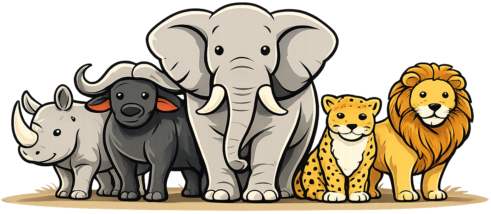

<p align="center">
  
</p>

# OCEAN Badges

Visual personality badges based on the Big Five (OCEAN) model.

This project is a **fork and extension** of the original **bigfive-web** project,
focused on transforming Big Five test results into clean, shareable visual artifacts
(SVG / PNG badges).

---

## Table of Contents

- [What is this?](#what-is-this)
- [Why badges?](#why-badges)
- [Social & research context](#social--research-context)
- [Privacy & data handling](#privacy--data-handling)
- [Ethical note (intended use)](#ethical-note-intended-use)
- [Technical overview](#technical-overview)
- [Who might find this useful?](#who-might-find-this-useful)
- [AI agents & human interaction (future direction)](#ai-agents--human-interaction-future-direction)
- [How to run locally](#how-to-run-locally)
- [Origin & attribution](#origin--attribution)
- [License](#license)

---

## What is this?

OCEAN Badges is a small web service that generates **visual personality badges**
based on Big Five test results.

The goal is not diagnosis or evaluation, but **visual reflection** —
a compact, human-readable way to express personality tendencies and start conversations.

Badges are designed to be:

- visually neutral
- non-judgmental
- easy to share
- easy to embed

---

## Why badges?

Text-heavy personality reports are hard to compare, discuss, or reference in social contexts.

A visual badge:

- lowers the barrier to communication
- helps people explain themselves without oversharing
- acts as a *conversation interface*, not a label

---

## Social & research context

This project can be seen as a **social visualization experiment**.

One possible future direction is the use of lightweight personality signals
in **hybrid systems**, where humans and AI agents interact as peers.

In such systems, *representation matters more than raw data*.

---

## Privacy & data handling

This project is designed with **privacy by default**:

- No user accounts
- No personal identification
- No linkage between badges and real identities
- No tracking or profiling
- Badge IDs are random and anonymous

---

## Ethical note (intended use)

Big Five results are **probabilistic and context-dependent**.

Badges generated by this project are intended for:

- personal reflection
- education
- communication

They should **not** be used as the sole basis for hiring, evaluation,
segregation, or discrimination.

This is a statement of intent, not a legal restriction.

---

## Technical overview

- Next.js (App Router)
- SVG-first rendering (shareable SVG + PNG)
- Redis (Upstash-compatible)
- No authentication required

---

## Who might find this useful?

- **Teams (especially remote ones)** — quick communication context
- **Gamification enthusiasts** — personality as character stats
- **UX / interface researchers** — compact representation of complex data

---

## AI agents & human interaction (future direction)

In future hybrid systems, humans and AI agents may benefit from
lightweight, voluntary personality metadata.

OCEAN Badges explore one such representation:
visual, non-authoritative, and explicitly non-diagnostic.

---

## How to run locally

> ⚠️ **Important**  
> Docker Compose is currently **not the recommended way** to run this project locally.
> The setup relies on an external Redis (e.g. Upstash) and is best run directly with Node.js.

### Recommended: Local Node.js + Redis

#### Prerequisites

- Node.js 18+
- pnpm
- Redis (Upstash or local)

#### Steps

```bash
cd web
pnpm install
pnpm dev
```

Create a `.env.local` file in `web/`:

```env
UPSTASH_REDIS_REST_URL=your_redis_url
UPSTASH_REDIS_REST_TOKEN=your_redis_token
```

Then open:

```
http://localhost:3000
```

---

### Docker (experimental)

Docker support exists but is currently **experimental** and may require adjustments
depending on Redis setup. It is not guaranteed to work out of the box.

---

## Origin & attribution

This project is a fork of:

- **bigfive-web** — https://github.com/alheimsins/bigfive-web

Based on:

- IPIP-NEO-PI: https://github.com/kholia/IPIP-NEO-PI
- Item/test data from: http://ipip.ori.org

This fork focuses specifically on **visualization and sharing**,
which was not the original goal of the upstream project.

---

## License

MIT — see [LICENSE](LICENSE)
